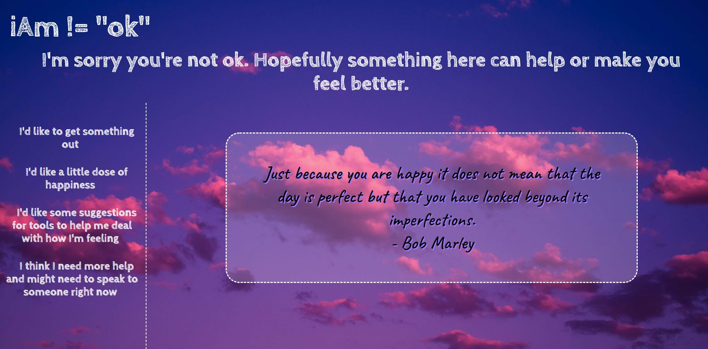
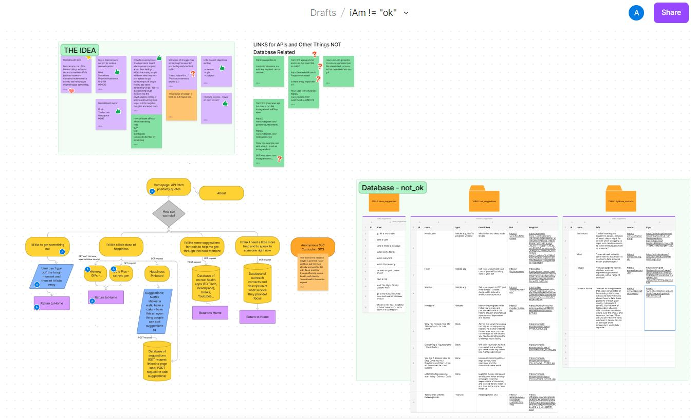
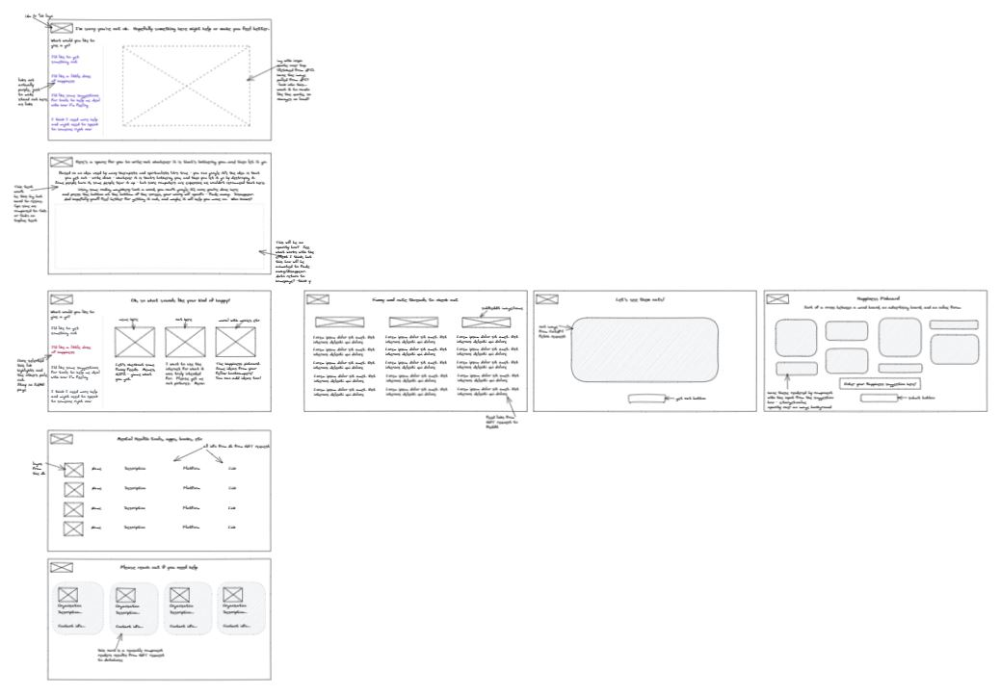
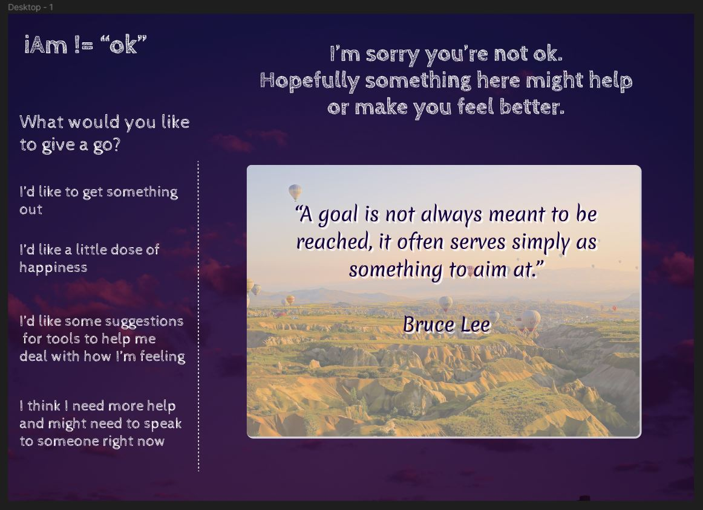

# iAm != "ok"

<!--[Visit the app](https://iam-notok.netlify.app/) - please note that following removal of the free tier of Heroku, this backend of this project was redeployed with Railway. Railway's recently updated policies mean the backend for this project will be available for approximately 21 days of every month, so you might visit the site during this downtime and notice some information/functionality is unavailable. Apologies if this happens, but I can't afford to pay to support hobby projects unfortunately :purple_heart: I might try to hardcode the backend data to get around this, but for now...-->

## The Project

I was inspired to work on a personal project from an idea I had when looking at solving a problem for bootcampers in the one week project I did as part of School of Code.

iAm != "ok" is a full stack community mental health app that I designed and built to offer a friendly and informative source for bootcampers who may be in need of tools or help to manage their mental health.

## Ideation

The app was planned and designed using Figma/Figjam and Excalidraw, where I brainstormed and mapped out requirements and the component tree/user journey, before creating low and high fidelity wireframes for clear direction to begin development.

## The Build

From the features I'd chosen, I went on to investigate methods to implement them, including API selection and npm libraries. Many of the things I built in the app required self-teaching, and the process increased my general awareness of methods and technologies as well as allowing me to develop further skills with React and Express.

The app is optimised for desktop and I focussed on making the CSS styling as responsive as possible. Because the app is aimed at tech bootcampers, I feel a desktop design would be appropriate because all bootcampers will be using laptops or computers for the bootcamp. Though ideally I'd optimise for mobile also, elements on the design don't lend themselves well to this (such as landscape background images and the side navigation bar), so I feel like to make the app mobile ready I would need to implement quite a heavy amount of re-styling - which is something I could definitely consider in the future.

## APIs

[zenquotes](https://zenquotes.io/)

[Reddit](https://www.reddit.com/) (using .json access)

[The Cat API](https://thecatapi.com/)

## Tech

React, React Router, Node.js, Express.js, CSS, JavaScript, HTML, ~~Heroku~~, ~~Railway~~, PostgreSQL, Netlify

## Feedback and Future Implementation

After the intial deployment I collected some user feedback and reiterated on a couple of the features on the site to improve the UI / UX, adding some extra functionality on the Funny Feeds page with individually scrolling divs, and a 'back to home' button on each page as a second option to clicking the site logo. There were also a handful of other small tweaks and changes, so overall this feedback was incredibly valuable.

For future iterations, I'd like to add the ability for users to suggest Tools and Contacts and to expand the offerings there. I'd also like to optimise for mobile as mentioned above.
